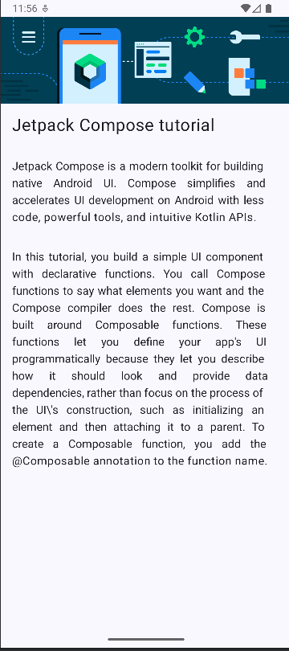

# 튜토리얼 페이지 흉내내기
## 주요 내용
배운 내용을 바탕으로 주어진 스크린샷에 해당하는 화면을 구성해 본다.

사진 자원을 활용하고 폰트 크기 및 정렬 등을 수행한다.

## Source
[https://developer.android.com/courses/android-basics-compose/course?hl=ko](https://developer.android.com/courses/android-basics-compose/course?hl=ko)
