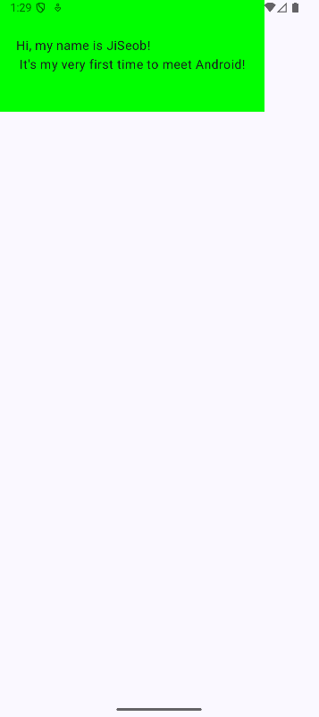

# 첫 번째 안드로이드 앱 만들기
## 주요 내용
첫번째 안드로이드 앱을 만들어 본다. Compose Preview 기능을 사용하고 배경색을 적용해본다.

## Source
[https://developer.android.com/courses/android-basics-compose/course?hl=ko](https://developer.android.com/courses/android-basics-compose/course?hl=ko)
