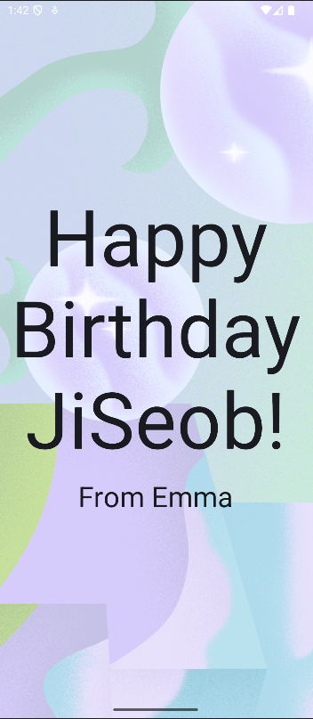

# 조금 더 복잡한 화면 구성해보기
## 주요 내용
Row, Column을 사용하는 방법과 정렬하는 방법에 대해 배운다.

그리고 텍스트뿐만 아니라 이미지를 프로젝트 및 화면에 추가하는 방법을 배운다.

## Source
[https://developer.android.com/courses/android-basics-compose/course?hl=ko](https://developer.android.com/courses/android-basics-compose/course?hl=ko)
